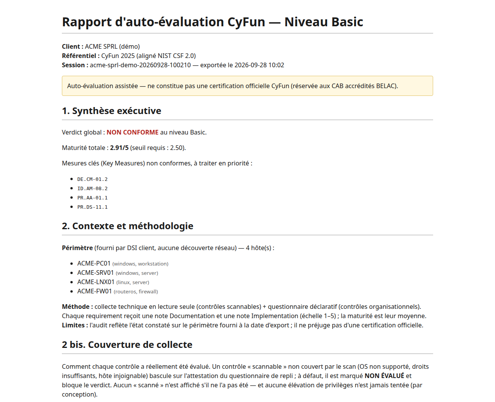
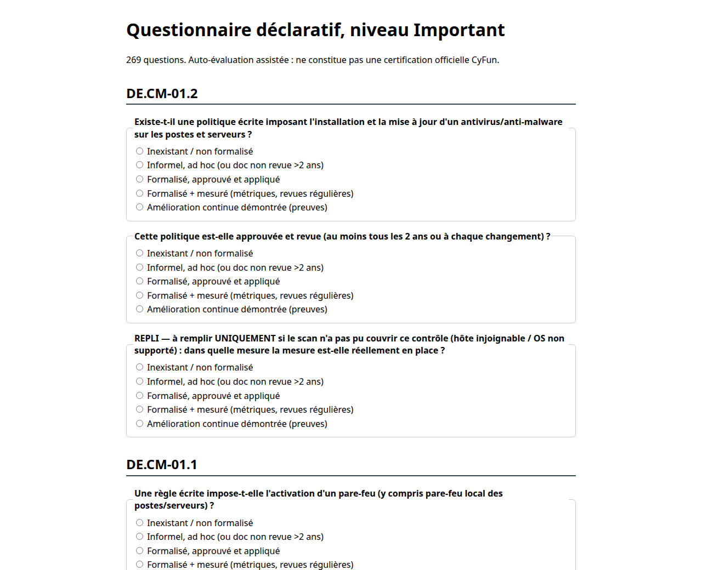

# ClawkWerk

[](https://github.com/warrox1993/ClawkWerk/actions/workflows/ci.yml)

Outil d'auto-évaluation de la cybersécurité d'une PME belge selon le référentiel
CyberFundamentals (CyFun) 2025 du Centre pour la Cybersécurité Belgique (CCB),
le référentiel que le CCB recommande pour mettre en œuvre les mesures de la loi
NIS2 belge. Écrit en Go, il collecte des preuves techniques en lecture seule,
sans agent à installer, les combine avec un questionnaire organisationnel et
calcule le verdict selon le barème des outils d'auto-évaluation du CCB.

Code source disponible, usage non commercial (voir [Licence](#licence)).

ClawkWerk prépare une organisation à l'évaluation ; il ne délivre ni
vérification (niveaux Basic et Important) ni certification (niveau Essential)
CyFun, ni présomption de conformité NIS2. En Belgique, celles-ci viennent d'un
organisme d'évaluation de la conformité (CAB) accrédité par BELAC et autorisé
par le CCB, d'une certification ISO/IEC 27001 acceptée par le CCB, ou d'une
inspection du CCB ([source : CCB](https://atwork.safeonweb.be/nis2)). Chaque
rapport produit le rappelle.



## Ce qui est couvert

| Niveau CyFun 2025 | Exigences | Key Measures | Scannables | Questions |
|---|---:|---:|---:|---:|
| Basic | 34 | 13 | 16 | 71 |
| Important | 133 | 22 | 44 | 269 |
| Essential | 218 | 29 | 66 | 439 |

- Les trois niveaux sont chargés avec le texte exact des exigences, les Key
  Measures et les seuils du CCB (Basic : 2,5 par Key Measure et en moyenne ;
  Important : 3 ; Essential : 3 par Key Measure et par catégorie, 3,5 en
  moyenne). Le calcul suit la méthode des outils d'auto-évaluation du CCB
  (moyenne par sous-catégorie, puis par catégorie, N/A remplacé par le
  seuil) ; il a été comparé aux trois classeurs officiels, voir
  [Validation en conditions réelles](#validation-en-conditions-réelles).
- Chaque exigence reçoit deux notes de 1 à 5, documentation et
  implémentation. Pour les exigences scannables, l'implémentation vient de la
  collecte technique ; le reste vient du questionnaire.
- 64 exigences ont une sonde Windows (PowerShell) et 64 une sonde Linux (shell
  POSIX, apt, dnf, zypper, pacman, apk), soit 24 sondes distinctes par système,
  réutilisées par famille de contrôles.
- 10 familles d'équipements réseau (MikroTik RouterOS, pfSense, FortiOS, Cisco
  IOS, PAN-OS, SonicOS, WatchGuard Fireware, Zyxel, Sophos XG, UniFi) pour le
  pare-feu, la segmentation et la journalisation, plus Microsoft 365 via
  l'API Graph en lecture.
- Transports : fichiers déjà rapatriés, SSH, WinRM (HTTPS, NTLM ou Basic,
  certificat vérifié par l'autorité du client) et API.
- Rapports JSON, HTML, XLSX et PDF : synthèse, méthodologie, couverture réelle
  de la collecte, résultats par fonction NIST CSF 2.0, plan de remédiation,
  annexes technique et légale.

## Architecture

```
périmètre (-scope)                         questionnaire (réponses)
      |                                            |
      v                                            v
 collecte  ->  normalisation  ->  évaluation  ->  agrégation  ->  session  ->  rapport
 (Source)      (brut -> preuve)   (pure, par     (multi-hôtes,   (verdict    (JSON, HTML,
                                   contrôle)      pire cas)       CCB,        XLSX, PDF)
                                                                  journal)
```

| Paquet | Rôle |
|---|---|
| `internal/scope` | Périmètre fourni par le client (fichier JSON), credentials jamais sérialisés |
| `internal/scan` | Sources de collecte en lecture seule : fichier, SSH, WinRM, API |
| `internal/cyfun/controls` | Un normaliseur et un évaluateur par contrôle, adaptateurs réseau |
| `internal/engine` | Registre des contrôles par niveau, orchestration, preflight |
| `internal/survey`, `internal/web` | Questionnaire déclaratif et son interface web locale |
| `internal/session` | Agrégation hiérarchique et verdict de conformité |
| `internal/audit` | Journal d'audit chaîné par SHA-256 |
| `internal/report` | Rapports HTML, XLSX, PDF et matrice de couverture |
| `internal/store` | Historique SQLite du consultant (build `-tags history` uniquement) |
| `cmd/orchestrator`, `cmd/questionnaire` | Les deux exécutables |

Le binaire est statique (`CGO_ENABLED=0`) et son build est reproductible
(`-trimpath`, identifiant de build vidé). Dépendances, toutes en Go pur :
`golang.org/x/crypto/ssh`, `github.com/masterzen/winrm`, `github.com/go-pdf/fpdf`
et, pour le build consultant seulement, `modernc.org/sqlite`.

## Garanties de sécurité

Chacune est portée par le code et vérifiée par des tests.

- Lecture seule : une commande de collecte ne peut être construite que par un
  constructeur qui la marque en lecture seule, et un test parcourt toutes les
  sondes des trois niveaux à la recherche de commandes destructrices. Aucune
  primitive d'écriture, d'élévation de privilèges ou de mouvement latéral
  n'existe dans le code.
- Clé d'hôte SSH obligatoire : le mode distant refuse de démarrer sans fichier
  `known_hosts`, et la source SSH refuse toute connexion sans politique de
  vérification.
- Secrets jamais sérialisés : le secret d'un compte de service est un champ
  non exporté, invisible pour `encoding/json` (test à canari), effacé de la
  mémoire en fin de session.
- Journal d'audit chaîné : chaque connexion et chaque commande sont
  journalisées avant exécution ; `audit.Verify` détecte toute modification,
  suppression ou permutation d'entrée. Aucune option ne désactive le journal.
- Périmètre explicite : seules les machines listées dans le fichier `-scope`
  sont contactées ; une plage réseau ou un motif est refusé.
- Aucune élévation automatique : le mode `-preflight` constate ce que le
  compte de service peut lire et liste ce que le client doit provisionner.
- Questionnaire local : écoute sur 127.0.0.1 uniquement, jeton anti-CSRF,
  contrôle des en-têtes Origin et Host, fichier de réponses en mode 0600.

## Démarrage rapide

Prérequis : Go 1.26.8 ou plus récent. Des binaires Linux et Windows sont aussi
publiés dans les [releases](https://github.com/warrox1993/ClawkWerk/releases).

```sh
git clone https://github.com/warrox1993/ClawkWerk.git
cd ClawkWerk

# Démonstration : périmètre sample/scope.json, preuves sample/evidence,
# réponses sample/responses.json. Verdict complet aux trois niveaux.
go run ./cmd/orchestrator -html rapport.html
go run ./cmd/orchestrator -level essential -pdf rapport.pdf -xlsx rapport.xlsx

# Droits du compte de service, puis matrice de couverture réseau
go run ./cmd/orchestrator -preflight
go run ./cmd/orchestrator -coverage

# Questionnaire web local (http://127.0.0.1:8099)
go run ./cmd/questionnaire -level important -out reponses.json
```

Audit réel : le client fournit la liste des machines et des comptes de
service en lecture seule.

```json
{
  "client": "ACME SPRL",
  "provided_by": "DSI client",
  "hosts": [
    {"id": "SRV-FICHIERS", "os": "windows", "role": "server",
     "address": "srv-fichiers.acme.lan", "transport": "winrm", "port": 5986,
     "cred_ref": "svc-audit-ro"},
    {"id": "WEB-01", "os": "linux", "address": "10.0.0.20",
     "transport": "ssh", "cred_ref": "svc-linux-ro"}
  ]
}
```

```sh
orchestrator -scope scope.json -transport remote \
  -creds creds.json -known-hosts known_hosts -preflight
orchestrator -scope scope.json -transport remote \
  -creds creds.json -known-hosts known_hosts \
  -responses reponses.json -level basic -html rapport.html -pdf rapport.pdf
```

`creds.json` associe chaque `cred_ref` à un identifiant et à un secret (mot de
passe ou clé privée SSH) ; il n'est jamais recopié dans les rapports.

WinRM : HTTPS avec vérification du certificat de l'hôte par l'autorité du
client (`-winrm-ca autorite.pem`), authentification NTLM par défaut (comptes
locaux et de domaine ; `-winrm-auth basic` si le client a activé Basic).
Droits minimaux constatés sur Windows 11 : compte non administrateur membre de
« Utilisateurs de gestion à distance » et « Lecteurs des journaux
d'événements », ce groupe étant autorisé dans le descripteur racine de WinRM
(détail dans [la validation](docs/methode/validation-reelle-2026-09-28.md)).
Avec ce compte, 59 des 64 collectes Windows aboutissent ; l'état BitLocker,
Device Guard et `w32tm` exigent un administrateur local, et `-preflight` les
signale comme « droits insuffisants » plutôt que d'en tirer une conclusion.



## Tests

- 411 tests et 282 sous-tests, tous verts, avec et sans `-tags history`, et
  sous le détecteur de courses (`-race`).
- Tests de propriété sur le calcul de maturité, verdicts de référence,
  fuzzing des normaliseurs (aucune panique sur entrée arbitraire).
- Sondes Windows : longueur de ligne de commande et absence de verbe
  d'écriture vérifiées pour les 64 sondes ; sorties réelles d'un Windows 11
  rejouées dans les tests.
- Sondes Linux exécutées dans un vrai shell POSIX avec de faux outils système,
  et un test qui vérifie que toutes les sondes Linux sortent proprement sur
  une machine minimale.
- `gofmt`, `go vet` et `staticcheck` sans remarque ; `govulncheck` : aucune
  vulnérabilité atteignable.

```sh
make check    # gofmt, vet, staticcheck, tests, govulncheck, go mod verify
make build    # binaires statiques dans bin/
```

La même chaîne tourne en CI à chaque push et pull request, avec un contrôle du
caractère statique et reproductible des binaires.

## Validation en conditions réelles

Détail et preuves : [docs/methode/validation-reelle-2026-09-28.md](docs/methode/validation-reelle-2026-09-28.md).

- Windows 11 Pro 25H2 (fr-BE), par WinRM HTTPS avec un compte non
  administrateur : les 64 sondes s'exécutent, 59 aboutissent et 5 sont
  signalées « droits insuffisants » ; 64/64 avec un administrateur local.
  Constats recoupés avec l'état réel de la machine.
- Ubuntu 26.04 : par SSH avec un compte non root, puis chaque sonde rejouée
  avec le compte `nobody` (aucun groupe) : constats recoupés un à un ; seul le
  journal système reste illisible sans groupe, signalé « droits
  insuffisants ».
- Une revue de code indépendante a relevé les sondes qui concluaient encore
  sur une valeur non mesurée ; toutes ont été corrigées et revalidées sur les
  deux machines.
- Calcul : mêmes notes saisies dans ClawkWerk et dans les trois outils
  d'auto-évaluation du CCB (recalcul LibreOffice), quatre jeux par niveau.
  Identité exacte avec la méthode publiée par le CCB ; verdict identique aux
  classeurs tels que publiés, dont les seuls écarts de score viennent
  d'anomalies de formules recensées (niveaux Important et Essential).
- Couverture : 34, 133 et 218 exigences, sans oubli ni doublon ; Key
  Measures, niveaux et sous-catégories identiques aux outils officiels.

## Limites assumées

- Les adaptateurs des dix familles d'équipements réseau ont été écrits
  d'après la documentation des constructeurs et n'ont pas été validés sur du
  matériel réel ; `-coverage` affiche ce statut pour chacun.
- Windows validé sur un seul poste (Windows 11 25H2 fr-BE, hors domaine) :
  ni Windows Server, ni versions néerlandaise ou allemande, ni compte de
  domaine. Microsoft 365 (API Graph) jamais exécuté contre un vrai tenant.
- Linux validé sur Ubuntu 26.04 et Debian ; dnf, zypper, pacman et apk ne
  sont testés que sur des sorties simulées.
- 18 des 34 exigences Basic (152 des 218 au niveau Essential) sont
  organisationnelles : leur note vient du questionnaire, c'est-à-dire d'une
  déclaration.
- La recette de clé USB live (`live/`) n'a jamais été démarrée.

## Méthode

Le projet a été développé en pilotant Claude Code : j'ai défini le besoin,
les règles de sécurité non négociables (lecture seule, aucune élévation,
périmètre explicite, journal obligatoire), l'architecture et les critères
d'acceptation, puis j'ai fait écrire, relire et tester le code par l'agent.
Les garde-fous sont dans le code et dans les tests plutôt que dans la
discipline : une commande de collecte destructrice, une vulnérabilité connue
atteignable, une course de données ou un fichier mal formaté fait échouer la
CI. Les documents de conception et le protocole
de validation terrain sont dans [`docs/methode`](docs/methode), l'historique
dans [`CHANGELOG.md`](CHANGELOG.md).

## Licence

Le code de ClawkWerk est publié sous la licence
[PolyForm Noncommercial 1.0.0](LICENSE) : code source disponible, usage non
commercial (usage personnel, recherche, enseignement, organismes non
commerciaux). Ce n'est pas une licence open source au sens de l'OSI. Tout
usage commercial demande l'accord de l'auteur.

Les textes du référentiel CyFun repris dans l'outil restent la propriété du
CCB et ne sont pas couverts par cette licence : voir [NOTICE](NOTICE).

## Source du référentiel

Les textes d'exigences, les Key Measures et les seuils proviennent des
documents CyFun 2025 publiés par le Centre pour la Cybersécurité Belgique sur
[cyfun.eu](https://cyfun.eu/en/cyberfundamentals-framework-2025) : livrets
BASIC, IMPORTANT et ESSENTIAL, outils d'auto-évaluation et Conformity
Assessment Scheme. Ces textes restent la propriété du CCB ; ils sont repris
tels quels, à titre d'extraits, avec mention de la source, conformément à
l'avertissement des livrets.
